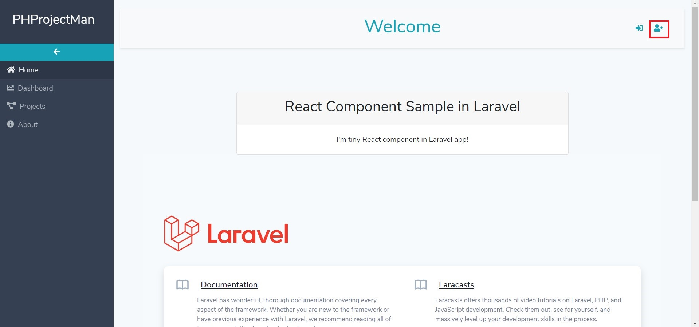
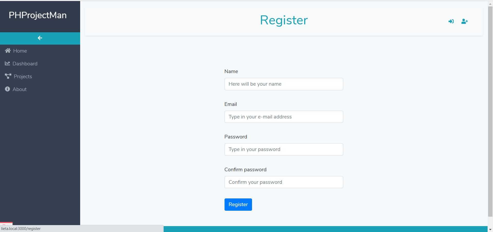
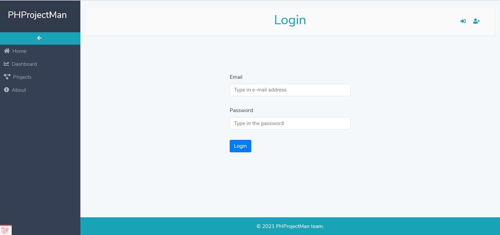
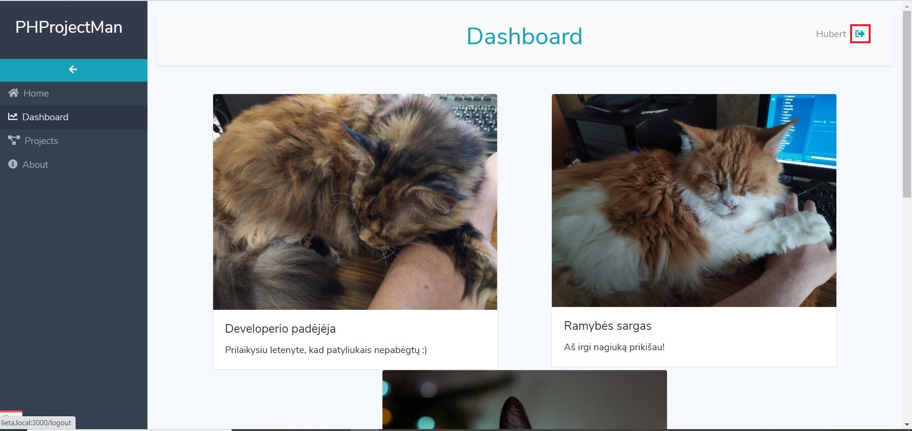
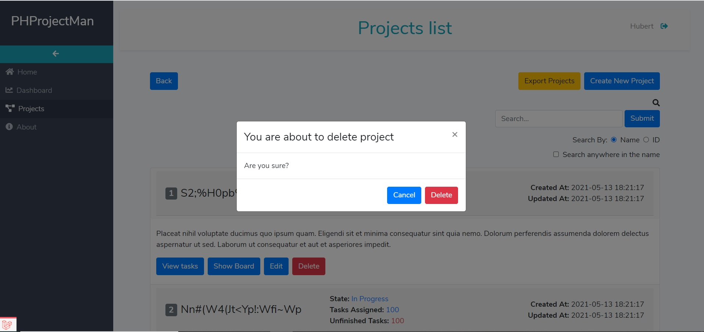
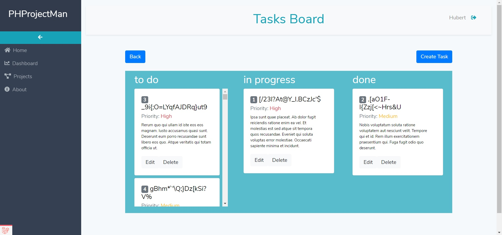

**User manual for PHProjectMan system**

**Home**

In home page you can find some general information about this project and its uses (*see Picture 1*).

*Picture 1*

**Register**

To register a new user account press register icon in the top right corner (*see Picture 2*). In user registration form fill in all fields and press **“Register”** (*see Picture 3*). If you made mistakes while filling the form, you will get error messages indicating what to correct. Note that error messages apply to all system forms. Once corrections are done press **“Register”** again. Upon successful registration you will be redirected to dashboard page. 

*Picture 2*

*Picture 3*

**Login**

To login as already registered user press login icon in the top right corner of the screen (*see Picture 4*). In the user login form fill in all fields and press **“Login”** (*see Picture 5*). You will get error messages indicating mistakes just like in registration form. After successful login you will be redirected to dashboard page.

*Picture 4*

*Picture 5*

**Logout**

If you want to logout from the system press logout icon in the top right corner of the screen (*see Picture 6*). Once icon pressed you will be asked to confirm logout (*see Picture 7*). Press **“OK”** to confirm or **“Cancel”** to be redirected back to the page you came from.

*Picture 6*

*Picture 7*

**Dashboard**

Dashboard page is where you can find system and database information and statistics (*see Picture 8*). It provides you with information about total number of projects and tasks in the database, number of finished projects and tasks and statistics about created projects and tasks this week.

*Picture 8*

**Projects list**

Projects list page can be accessed via **“Projects”** link in the left side sidebar (*see Picture 9*). Each project provides you with project id, name, state, information about tasks, project creation and modification dates. In this page you can search for projects by their name or id. This is done by entering your search keyword or project id in the **search input**, selecting **search by** option accordingly and pressing **“Submit”** button. You can also download projects list in csv format by pressing yellow **“Export Projects”** button, access project creation (**“Create New Project”** button) and editing (**“Edit”** button) forms, delete project (**“Delete”** button) or navigate to project tasks (**“View tasks”** button) and tasks board (**“Show Board”** button) pages. Top left **“Back”** button brings you to dashboard page.

*Picture 9*

**Tasks list**

Tasks list page for specific project can be accessed via **“View tasks”** button (*see Picture 9*). Each task provides you with task id, name, priority, state, description, task creation and modification dates (*see Picture 10*). In this page you can search for tasks by their name or id. This is done by entering your search keyword or project id in the **search input**, selecting **search by** option accordingly and pressing **“Submit”** button. You can also download tasks list in csv format by pressing yellow **“Export Tasks”** button, access task creation (**“Create Task”** button) and editing (**“Edit”** button) forms or delete task (**“Delete”** button). Top left **“Back”** button brings you to projects list page.

*Picture 10*

**Create project/task**

To create a new project fill in all fields in the form and press **“Create Project”** button (*see Picture 11*). You will get a message about successful creation, otherwise you will get error messages. If latter happens, correct mistakes and try again. Same rules apply when creating tasks.

*Picture 11*

**Edit project/task**

To edit project change the fields you want and press **“Update Task”** button (*see Picture 12*). You will get a message about successful update, otherwise you will get error messages. If latter happens, correct mistakes and try again. Same rules apply when editing tasks.

*Picture 12*

**Delete project/task**

To delete project press **“Delete”** button (*see Picture 13*). When you will be prompted for confirmation, press **“Delete”** or **“Cancel”** button in the pop up window accordingly. Same applies when deleting tasks.

*Picture 13*

**Tasks board**

Tasks board page is where you can see tasks states more visually (*see Picture 14*).  State can be changed by dragging desired task to appropriate state column. You can also delete tasks by pressing **“Delete”** button next to a task or access task edit form by pressing **“Edit”** button. To create new task press **“Create Task”** button. You can return to projects list page by pressing **“Back”** button.

*Picture 14*

**About**

The about page embodies interests of developers team behind the project. It can be accessed by pressing **“About”** link in the left side sidebar. This page is more for an artistic, creative content, than to provide detailed information, so we hope you will not take it very seriously. In spite of that, feel free to look around, get a laugh or get inspired.